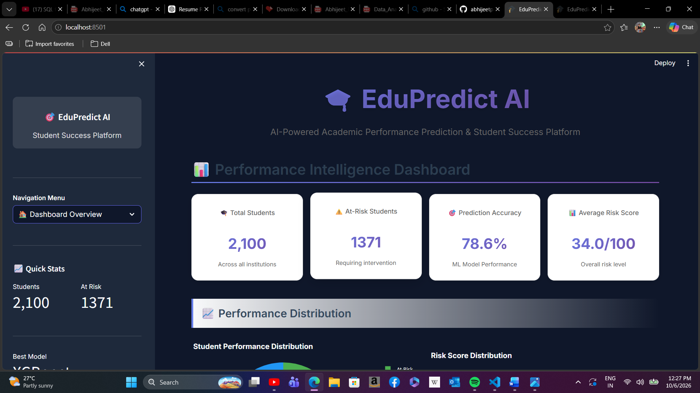
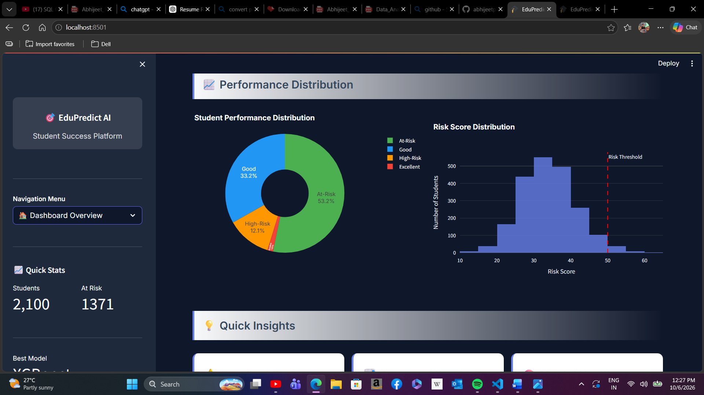
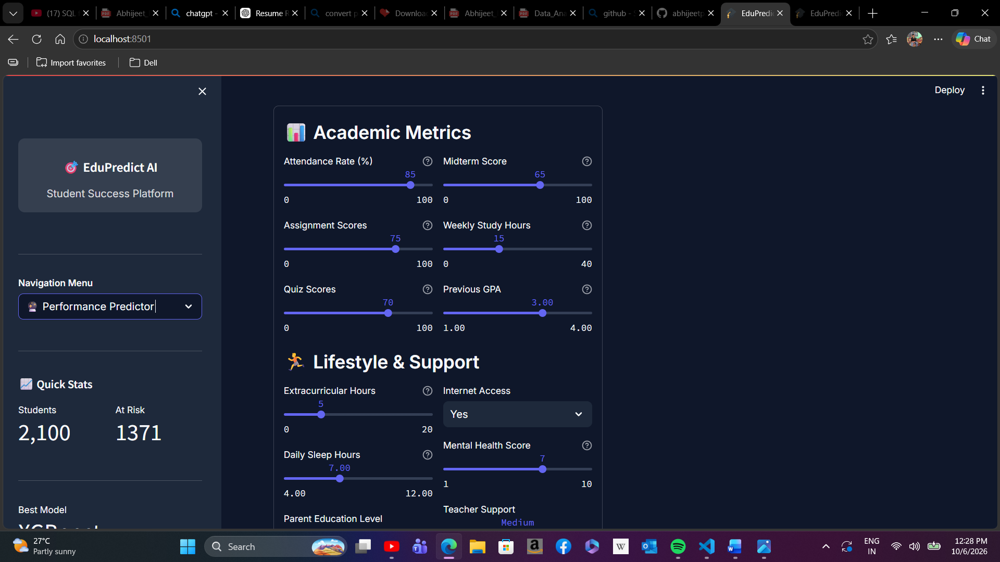
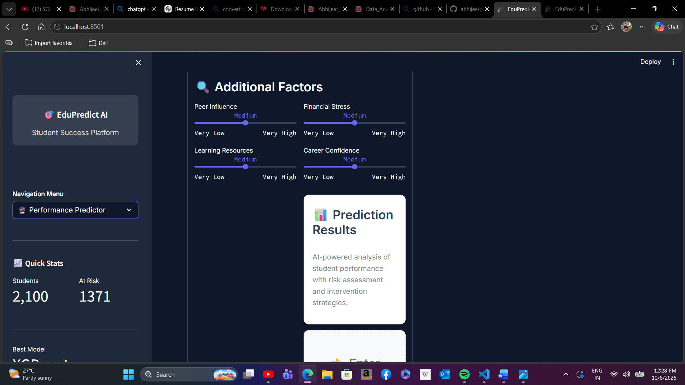
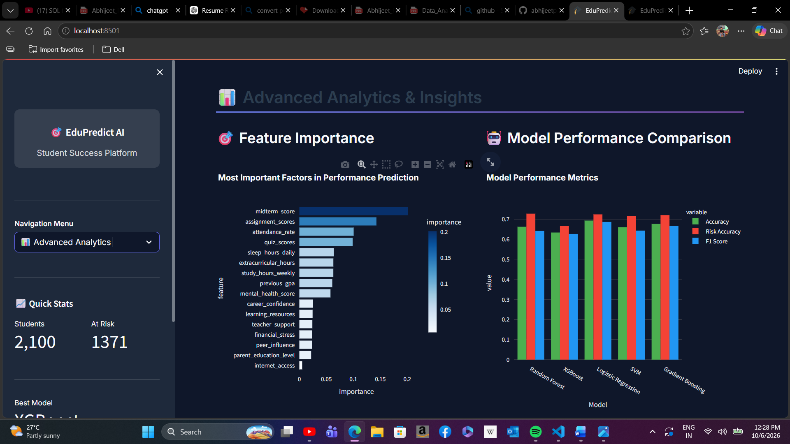
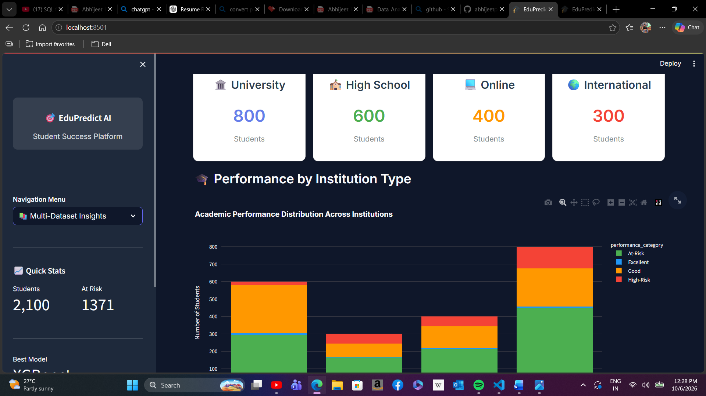
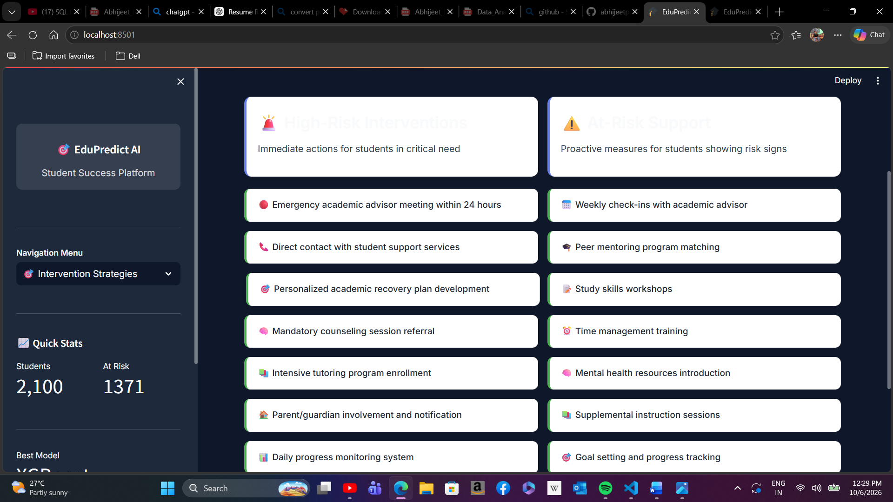
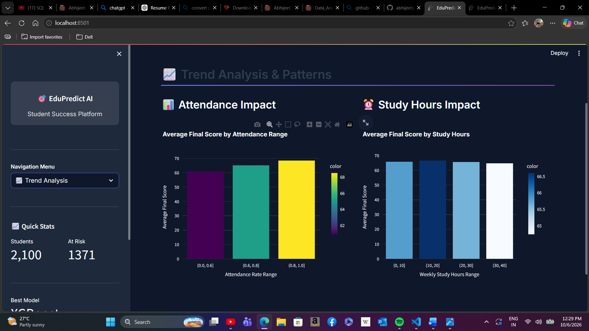

# 🎓 EduPredict AI - Student Academic Performance Prediction

## 📊 Overview

EduPredict AI is an AI-powered student success and academic performance prediction platform built with Python and Streamlit. The application analyzes academic, lifestyle, support, and other student-related factors to provide performance predictions, risk assessment, advanced analytics, and intervention strategies.

## 🚀 Features

### 1. **Performance Intelligence Dashboard**

The dashboard provides a high-level view of student performance and risk indicators.

- Total students: **2,100**
- At-risk students: **1,371**
- Prediction accuracy: **78.6%**
- Average risk score: **34.0/100**
- Performance distribution and risk-score analysis



### 2. **Performance Distribution**

The application visualizes student performance categories and risk-score distribution to help understand the overall student population.



### 3. **Academic Metrics**

The prediction interface considers important academic indicators such as:

- Attendance rate
- Midterm score
- Assignment scores
- Weekly study hours
- Quiz scores
- Previous GPA



### 4. **Prediction Results**

The platform combines academic, lifestyle, support, and additional factors to generate student performance and risk insights.

- Risk assessment
- Personalized student analysis
- Performance prediction
- Intervention-oriented insights



### 5. **Advanced Analytics & Model Performance**

The analytics section provides:

- Feature importance analysis
- Model performance comparison
- Accuracy, risk accuracy, and F1-score comparison
- Identification of important factors influencing student performance



### 6. **Multi-Dataset Insights**

The application compares academic performance across different institution types and presents category-wise performance distributions.



### 7. **Intervention Strategies**

The platform provides targeted support strategies for students who require intervention, including academic, mentoring, study-support, and progress-monitoring actions.



### 8. **Trend Analysis & Patterns**

The application analyzes how factors such as attendance and weekly study hours relate to average final scores.



## 📈 Project Outcome

The project provides an interactive machine learning application for student academic performance prediction and risk assessment. In the demonstrated dashboard, the system reports **2,100 students**, **1,371 at-risk students**, a displayed **78.6% prediction accuracy**, and an **average risk score of 34.0/100**.

The application also extends beyond prediction by presenting feature importance, model comparison, performance distributions, trend analysis, institution-level insights, and intervention strategies.

## 🛠️ Tech Stack

| Technology | Purpose |
|---|---|
| Python | Core programming language |
| Streamlit | Interactive web application |
| Pandas | Data handling and preprocessing |
| NumPy | Numerical operations |
| Scikit-learn | Machine learning and model evaluation |
| Plotly | Interactive charts and visualizations |
| Matplotlib / Seaborn | Data visualization |

## 📦 Installation

### 1. Clone the Repository

```bash
git clone https://github.com/abhijeetpainuly3-ship-it/Student-Academic-Performance-Prediction.git
cd Student-Academic-Performance-Prediction
```

### 2. Install Dependencies

```bash
pip install -r requirements.txt
```

### 3. Run the Application

```bash
python -m streamlit run app.py
```

Open the local Streamlit URL shown in the terminal, normally:

```text
http://localhost:8501
```

## 📁 Project Structure

```text
Student-Academic-Performance-Prediction/
│
├── app.py
├── requirements.txt
├── README.md
├── .gitignore
└── images/
    ├── dashboard-overview.png
    ├── performance-distribution.png
    ├── academic-metrics.png
    ├── prediction-results.png
    ├── advanced-analytics.png
    ├── multi-dataset-insights.png
    ├── intervention-strategies.png
    └── trend-analysis.png
```

## 🎯 Key Highlights

- Machine learning-based academic performance prediction
- Student risk assessment
- Interactive Streamlit dashboard
- Feature importance analysis
- Model performance comparison
- Multi-dataset and institution-level analysis
- Trend and pattern analysis
- Intervention strategy recommendations

## 👨‍💻 Author

**Abhijeet Painuly**

